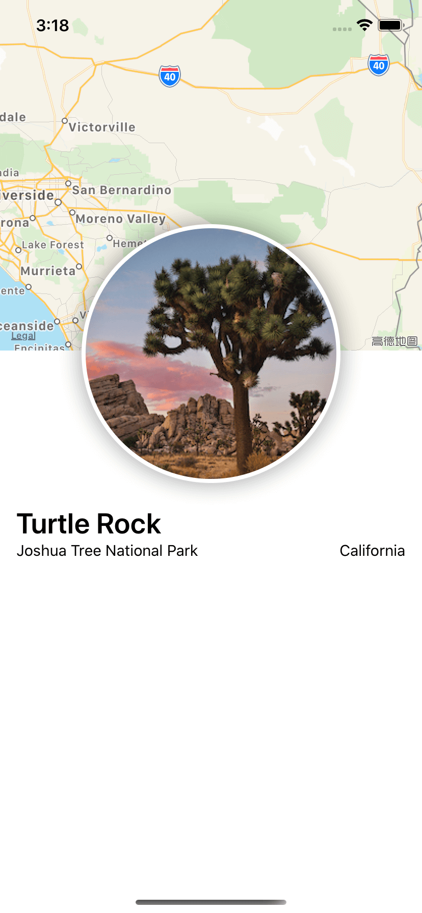
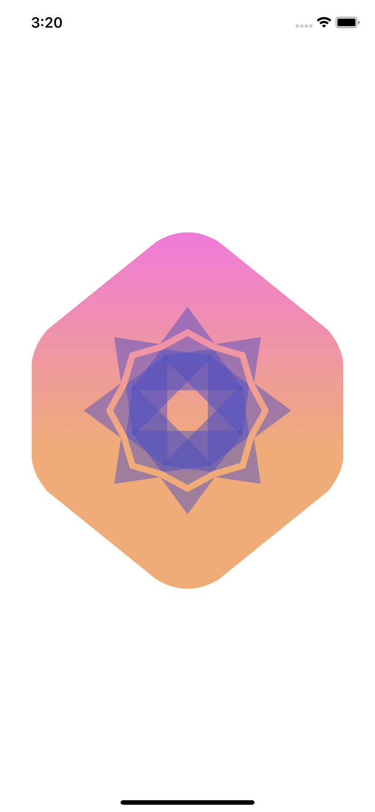
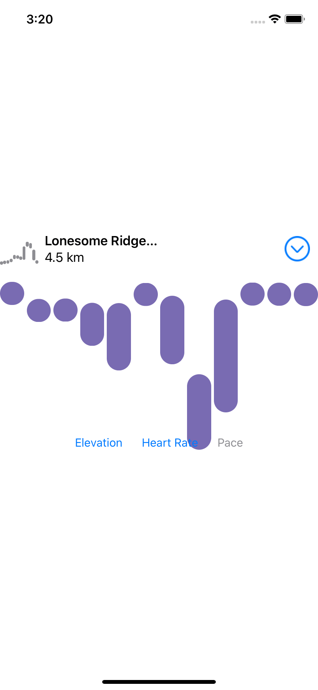
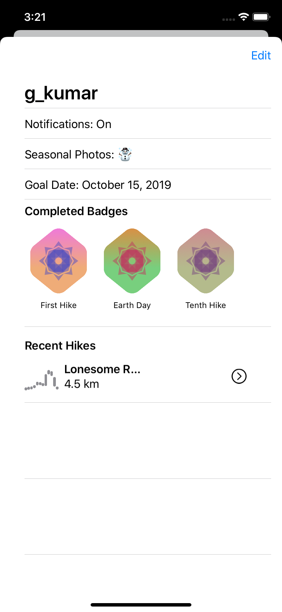
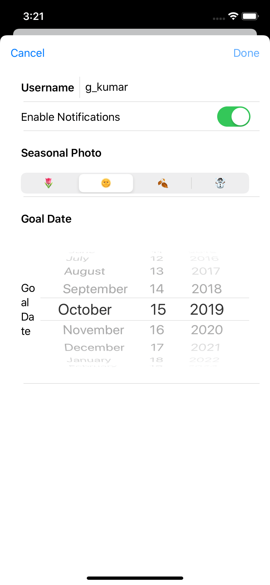

# SwiftUI-Tutorials

https://developer.apple.com/tutorials/swiftui

### Overview

 + 1 Creating and Combining Views
 + 2 Building Lists and Navigation
 + 3 Handling User Input
 + 4 Drawing Paths and Shapes
 + 5 Animating Views and Transitions
 + 6 Composing Complex Interfaces
 + 7 Working with UI Controls
 + 8 Interfacing with UIKit

### Screenshot
|||||
|  ----  | ----  |  ----  | ----  |
|   |  |   |  |
|  |  |   |  |
|  |  |   |  |

### 知识梳理

